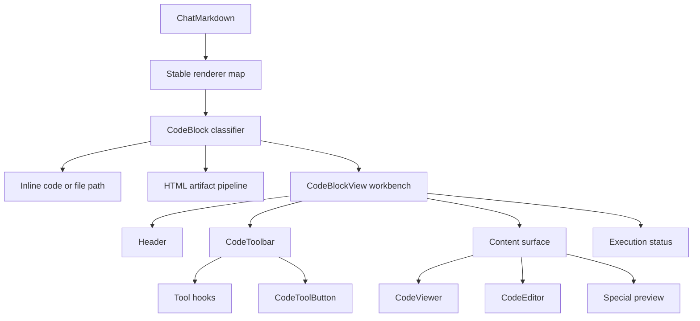

# Code Block Rendering

## Overview

Code block rendering has two separate responsibilities:

- `CodeBlock` classifies Markdown content and routes inline code, file paths, HTML artifacts, and ordinary fenced code.
- `CodeBlockView` owns the workbench for ordinary fenced code and special-language previews.

HTML artifacts keep their own preview, security, and consent pipeline. They are not modes of `CodeBlockView`.

## Component Structure

## Stable Markdown Renderers

The chat Markdown component map is defined at module scope. Renderer functions read the current block ID, citation
registry, inline HTML mode, and streaming state from one memoized render context.

Changing streaming state therefore updates renderer props without creating new React component types. Existing code,
table, link, and image nodes keep their identity across stream updates.

## View State

`ViewMode` represents user-visible content selection:

- `source`: read-only source in `CodeViewer`
- `edit`: editable source in `CodeEditor`
- `special`: Mermaid, PlantUML, SVG, or Graphviz preview
- `split`: special preview and source side by side

Initial behavior preserves the existing editor preference:

- Ordinary code that is already settled starts in `edit` when editing is enabled.
- Ordinary code that starts streaming uses `source` and stays on the same Viewer when the stream settles.
- Special languages start in `special`.

Entering split mode remembers the previous mode. A split entered from edit keeps the Editor on the source side; other
split paths use the Viewer.

## Streaming Behavior

`isStreaming` controls only streaming-specific behavior:

| State | Viewer highlighting | Collapsed auto-scroll | Enter edit |
|---|---|---|---|
| streaming | disabled | enabled while pinned to the bottom | unavailable |
| settled | enabled in place | disabled | available when editing is enabled |

Changing `isStreaming` must not select a different content component. A Viewer created for a stream receives the final
content and highlighting option in place.

Special previews retain an enabled source/preview toggle while streaming. After settling, editable code can enter edit
mode without requiring the preview component to change during the stream transition.

## Tool System

The existing tool hooks register copy, download, edit/source, split, run, expand, wrap, and save actions with
`CodeToolbar`. `CodeToolbar` owns only its overflow state, and `CodeToolButton` owns only its child-menu state.

Copy, download, and run callbacks read the latest streamed source from a ref. Their identities therefore remain stable
as source chunks arrive, so the registration effects do not cycle for every chunk. Copy actions return an explicit
success result so failed clipboard operations do not show success feedback.

## Content Surfaces

### CodeViewer

`CodeViewer` is the source surface for active streams. The same instance receives growing content, enables highlighting
when settled, and retains its caller ID, virtualizer, selection state, and DOM.

### CodeEditor

Existing settled code may start in `CodeEditor` when the editor preference is enabled. Code that started streaming
enters the Editor only through the edit action, avoiding a Viewer-to-Editor replacement at stream completion.

### Special Previews

The special-language map lazy-loads Mermaid, PlantUML, SVG, and Graphviz previews. Preview selection and split mode are
user-driven and do not depend on streaming completion.
